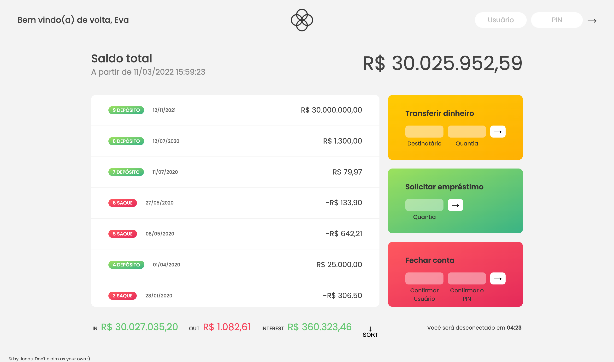

# Banco Quântico Project

## Funcionalidade
Este lindo app bancario permite aos usuários:
- Transferir dinheiro entre os usuários
- Solicitar empréstimo 
- Apagar a conta 
- balanço total doque entra e sai da conta

## Habilidades
neste projeto trabalhamos com:
- Matrizes 
- Números 
- Datas 
- Cronômetros 
- Fake "login"

### Linguagem 
- HTML
- CSS
- JavaScript

## Fluxograma
<!--  -->

### Pode testa-lo aqui no netlify: [bancoquantico-webapp-monteiro](https://bancoquantico-webapp-monteiro.netlify.app/)

Usuários:
1) usuário: ef -> PIN: 1111
2) usuário: hs -> PIN: 2222

